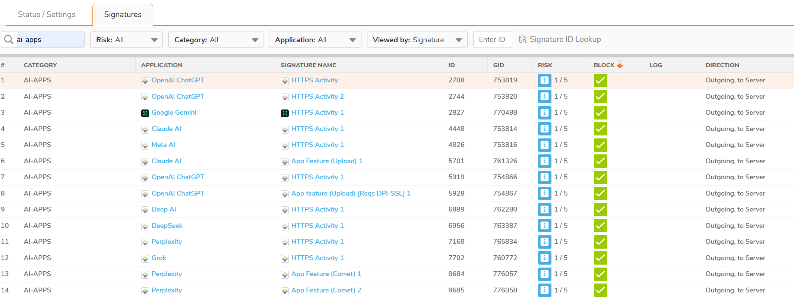
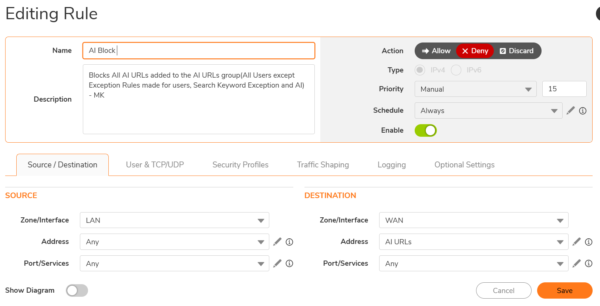
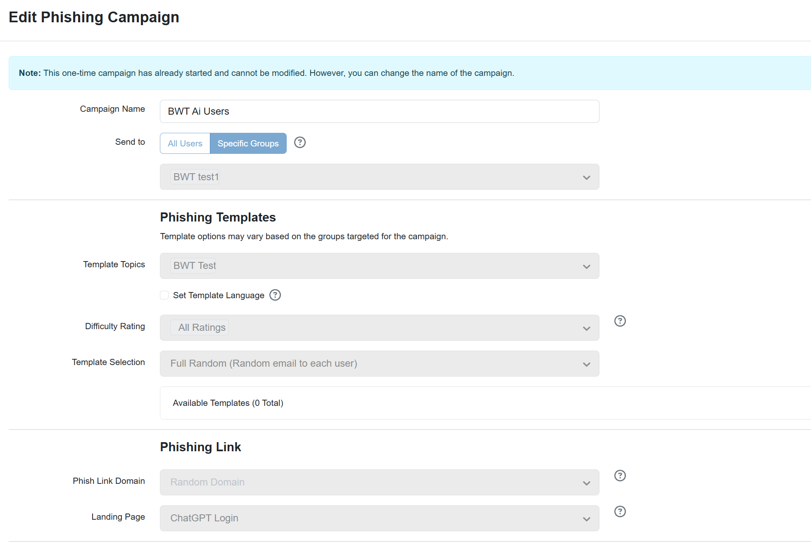
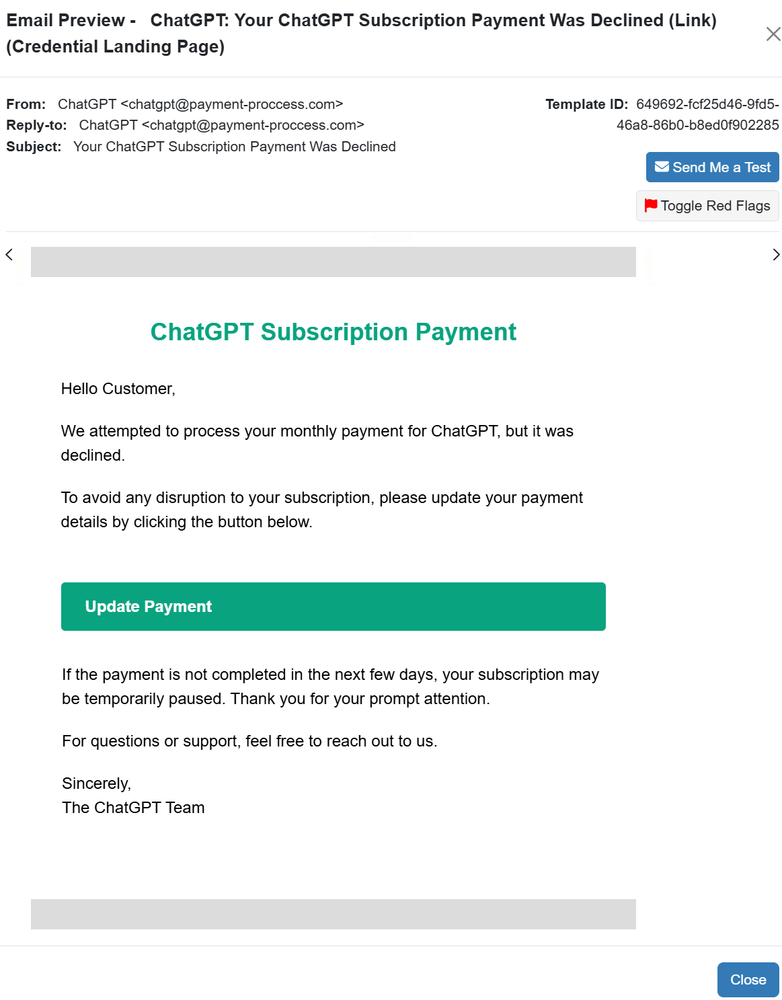
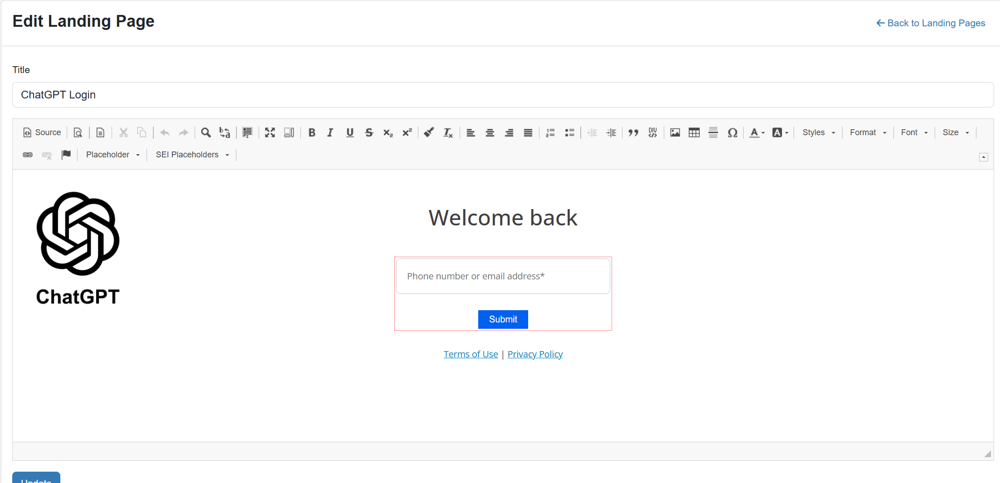
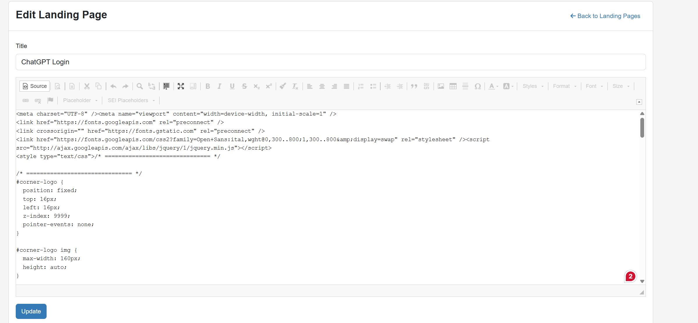

# Phishing Awareness Campaign & AI Platform Access Control

> A real-world security awareness project documenting a simulated phishing campaign targeting AI platform users, combined with firewall-level application control to restrict access to approved AI services only.

---

## Overview

This project documents a security awareness exercise conducted to test and educate end users on the risks of phishing — specifically targeting users of AI platforms. As part of the same initiative, all non-approved AI platforms were blocked at the network perimeter using firewall App Control signatures and Access Control List (ACL) rules, ensuring users could only access Claude.ai through a controlled and monitored environment.

The goal was to:
- Restrict AI platform access to users with a legitimate business case only
- Simulate a realistic credential-harvesting phishing attack to assess user awareness
- Educate users who failed the simulation on how to identify phishing attempts

---

## Project Structure

```
├── README.md
├── firewall-config/
│   ├── screenshots/
│   │   ├── 01-app-control-signatures.png
│   │   └── 02-acl-block-rule.png
│   └── config-notes.md
├── phishing-campaign/
│   ├── screenshots/
│   │   ├── 03-knowbe4-campaign-setup.png
│   │   ├── 04-phishing-email-template.png
│   │   ├── 05-landing-page-preview.png
│   │   ├── 06-landing-page-source.png
│   │   └── 07-awareness-landing-page.png
│   └── campaign-notes.md
└── results/
    └── summary.md
```

---

## Step 1 — Firewall App Control: Blocking AI Platform Signatures



Using the firewall's App Control engine, AI-APPS category signatures were identified and set to **Block** for all users without an approved exception. This covered the application signatures for the following platforms at the HTTPS traffic level:

- OpenAI ChatGPT
- Google Gemini
- Claude AI (blocked for unauthorised users)
- Meta AI
- DeepSeek
- Deep AI
- Perplexity
- Grok

Each signature was configured as **Outgoing, to Server** — blocking traffic at the point of egress before it could reach the external AI service. Only users with a documented business case were granted an exception, allowing them to access Claude.ai exclusively.

---

## Step 2 — ACL Rule: Block WAN Access to All AI URLs



An Access Control List (ACL) rule named **"AI Block"** was created to enforce the policy at the network layer. The rule was configured as follows:

| Setting | Value |
|---|---|
| Rule Name | AI Block |
| Action | Deny |
| Source Zone / Interface | LAN |
| Source Address | Any |
| Destination Zone / Interface | WAN |
| Destination Address | AI URLs (custom address group) |
| Schedule | Always |
| Status | Enabled |

The **AI URLs** destination address group contains the fully qualified domain names and wildcard entries for all AI platforms subject to the block policy (e.g. `*.openai.com`, `*.gemini.google.com`, `*.deepseek.com`, etc.). This ensures any traffic originating from the internal LAN destined for a listed AI URL is denied before leaving the network perimeter.

The rule description notes that exceptions are handled separately for users with approved business cases, search keyword exceptions, and permitted AI access.

---

## Step 3 — KnowBe4: Creating the Phishing Campaign



The phishing simulation was created and managed within the **KnowBe4** security awareness platform. The campaign was configured as follows:

- **Campaign Name:** BWT AI Users
- **Send To:** Specific Groups (targeting the user group identified as active AI platform users)
- Campaigns activate approximately 10 minutes after creation or scheduled start

Targeting a specific group rather than all users allowed the simulation to focus on the cohort most likely to interact with AI-platform-themed lures.

---

## Step 4 — Phishing Email Template: Impersonating a ChatGPT Payment Decline



A phishing email template was created to impersonate a legitimate ChatGPT billing notification. The email was designed to create a sense of urgency by claiming the recipient's monthly subscription payment had been declined, prompting them to click a link to update their payment details.

Key social engineering elements used:

- **Spoofed sender address:** `chatgpt@payment-proccess.com` (deliberate misspelling to mimic a legitimate billing domain)
- **Subject line:** "Your ChatGPT Subscription Payment Was Declined"
- **Call to action:** A prominent "Update Payment" button linking to the credential-harvesting landing page
- **Urgency trigger:** Warning that the subscription would be paused if payment was not completed promptly
- **Template type:** Credential Landing Page

This template was selected because users blocked from ChatGPT at the network level might be more likely to interact with a payment-related email out of concern for an existing personal subscription.

---

## Step 5 & 6 — Landing Page: Mirroring the ChatGPT Login Page




A credential-harvesting landing page was created within KnowBe4 and customised to closely replicate the appearance of the legitimate ChatGPT login page. The page included:

- The official ChatGPT logo and branding
- A "Welcome back" heading consistent with the real login flow
- A form field requesting a phone number or email address
- A Submit button
- Terms of Use and Privacy Policy links to further reinforce legitimacy

The source code was edited directly to mirror the styling and layout of the genuine ChatGPT authentication page, including Google Fonts integration and custom CSS positioning for the corner logo overlay. This level of visual fidelity was intentional — designed to test whether users would scrutinise the URL and domain before entering credentials.

---

## Step 7 — Awareness Landing Page: Post-Submission Education


Users who submitted their credentials on the fake login page were immediately redirected to an awareness landing page branded with the organisation logo. The page displayed a clear message informing the user that they had fallen for a simulated phishing test, and provided three key reminders:

1. Always verify the source of messages requesting your information or action
2. Check URLs carefully before clicking links
3. Never provide sensitive information unless you are certain of the recipient's identity

This immediate in-the-moment education is a core principle of effective phishing simulation — users receive feedback at the exact point of failure, which significantly improves retention compared to post-campaign awareness emails alone.

---

## Key Takeaways

- AI platform users represent a realistic and targeted phishing audience — lures themed around AI subscription billing are credible and effective
- App Control signatures combined with ACL deny rules provide defence-in-depth at the application and network layers without requiring a full web proxy deployment
- KnowBe4's campaign tooling allows precise targeting by user group, enabling focused simulations without unnecessary disruption to the wider organisation
- Immediate post-click awareness education is more effective than retrospective training alone
- Combining network-level access control with user awareness training creates a significantly stronger security posture than either measure in isolation

---

## Tools & Platforms Used

| Tool | Purpose |
|---|---|
| Firewall (App Control) | AI-APPS signature blocking by application category |
| Firewall (ACL) | Network-layer deny rule targeting AI URL address group |
| KnowBe4 | Phishing campaign management, template creation, landing pages |

---

## About This Project

As part of my role as a Cybersecurity Analyst at BWT, a core responsibility is protecting the organisation's users and infrastructure from evolving threats. This means not only implementing technical controls — such as firewall policies to govern which platforms users can access — but also ensuring those users are equipped to recognise and resist social engineering attacks.

Phishing remains one of the most common and effective attack vectors, and AI platforms are an increasingly realistic lure given how widely they are used in the workplace. This project combines both sides of that responsibility: locking down the network perimeter to enforce a controlled AI access policy, and testing whether users would fall for a phishing attempt themed around the very tools they use day to day.

The objective is simple — reduce risk. Technical controls alone are not enough; the human layer matters just as much.

---

## Disclaimer

This project was conducted in a controlled environment on an internal network with full organisational authorisation. All phishing simulations were approved security awareness exercises. No real credentials were captured, stored, or misused at any point. This documentation is shared purely for educational and knowledge-sharing purposes within the security community.

---

## Author

**Mamudu Kankasa**  
Security Awareness & Network Security Project — 2025  
Cybersecurity Analyst — BWT

> If you found this useful, feel free to ⭐ the repo or open an issue with questions.
